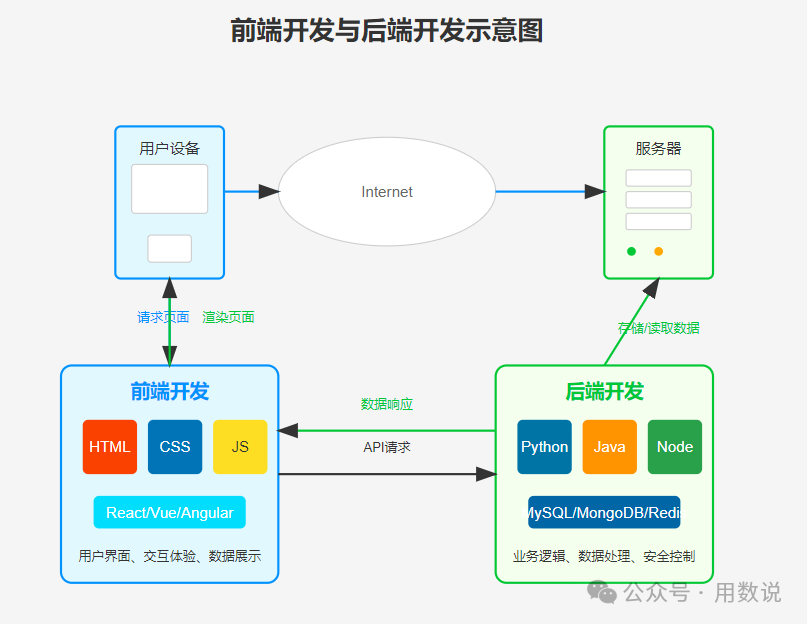
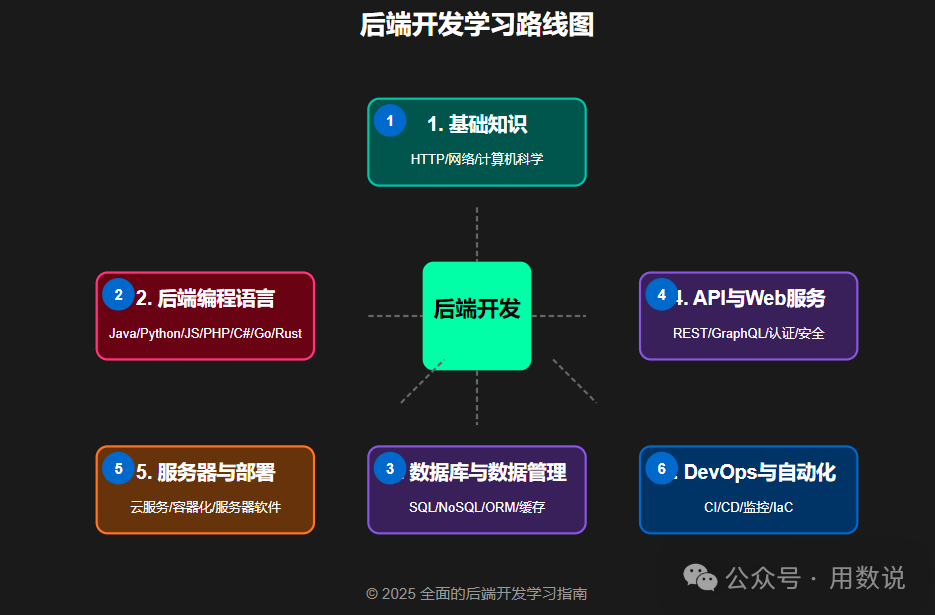

## 前端：你看到的网页都是它的地盘
[前端学习路线](https://blog.csdn.net/2401_83607690/article/details/147620717)
想象一下，你打开淘宝看到的商品图片轮播、点外卖时跳转的页面、刷短视频时的点赞动画……这些<font color="#d99694">所有你能看见和交互的界面</font>，都是前端工程师搞定的。学前端主要掌握三件套：

1. **HTML**：网页的骨架，决定有什么内容
2. **CSS**：网页的衣服，负责好不好看
3. **JavaScript**：网页的灵魂，让按钮能点击、图片会滑动

学前端最大的成就感是什么？今天写的代码，明天就能在浏览器里看到效果！特别适合喜欢**即时反馈**和**视觉设计**的人。
# 1. HTML：网页的骨架
就像盖房子要先搭钢筋架子：
> - 学习常用标签:`<div> <p> <a>`这些积木块
> - 掌握表单制作:登录框,搜索栏的实现
> - 理解语义化:让代码想说明书一样好读
>   
>不要死记硬背,边学边用记事本写个人简介页面,三天就能上手

# 2. CSS：给你的网页"化妆"
光有骨架太丑了，CSS负责让页面变精致：
> - 盒模型理解：margin/padding就像套娃
> - Flex布局：现在最流行的排版技巧
> - 媒体查询：让网页在手机电脑都好看
> - 动画效果：按钮hover变色这种小细节
>    
>建议模仿你喜欢网站的风格做练习，比如把某宝首页颜色全改成莫兰迪色系。

# 3. JavaScript：让网页活起来
如果说HTML是骨架，CSS是衣服，JS就是让网页能跑能跳的灵魂：
> - 基础语法：变量、循环这些编程套路
> - DOM操作：用代码点击按钮弹出窗口
> - 事件处理：滚动页面时导航栏自动缩小
> - 异步请求：不刷新页面加载新数据
> 
> 重点来了！学JS时一定要多做项目，写个计算器或天气预报小插件比看10小时视频管用。

# 4. 前端框架：开发效率神器
学到这儿你就能做完整项目了，但想进公司还得会这些：
> - Vue/React/Angular三选一：国内Vue用的多，国外偏爱React
> - 组件化开发：把页面拆成乐高模块
> - 状态管理：Vuex/Pinia这种数据管家
> 
> 别纠结学哪个！就像手机用安卓还是iOS，先精通一个再说。

# 5. 加餐必备技能包
> - Git代码管理：学会用GitHub存代码
> - Webpack/Vite：项目打包工具
> - TypeScript：给JS加个类型保险
> - 基础UI框架：Element Plus/Ant Design

---
## 后端：藏在幕后的数据大管家
[后端学习路线](https://zhuanlan.zhihu.com/p/1903851687149573590)
## 什么是后端开发？
后端开发是指在服务器端进行的开发工作，主要负责处理前端（用户界面）发送的请求，执行业务逻辑，与数据库交互，并将结果返回给前端。后端开发者需要确保系统的高性能、安全性和可扩展性。

如果说前端是餐厅服务员，后端就是后厨厨师。你登录账号时的密码验证、微信抢红包的金额计算、支付宝的余额变动……这些<font color="#d99694">看不见但至关重要的逻辑</font>全是后端在支撑。

学后端要折腾这些：
- **数据库**：比如MySQL，像巨型Excel存所有数据
- **服务器语言**：Java/Python/PHP，处理业务逻辑
- **API接口**：让前端能拿到后厨做好的“菜”


后端工程师更像是**逻辑控**和**问题解决者**，适合喜欢钻研技术原理的人。


##### 代码示例

```C
#include<stdio.h>
int main(void){
    printf("hello, world!\n");
    return 0;
}

```
